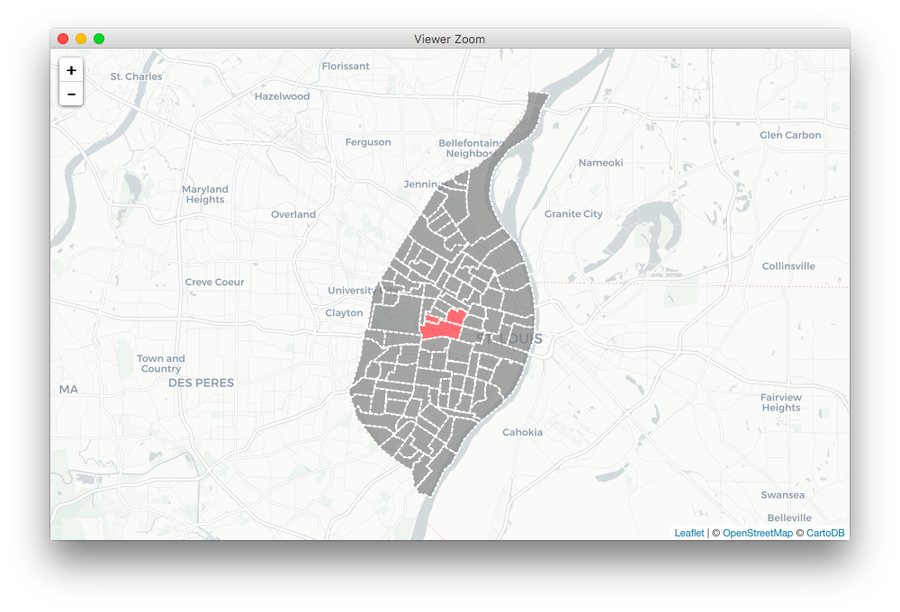
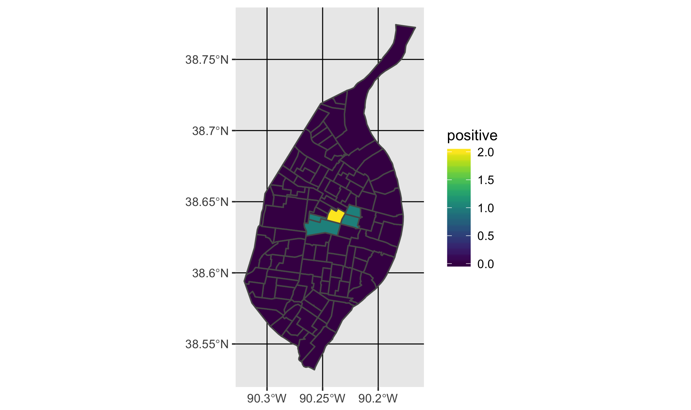

```{r setup, include = FALSE}
knitr::opts_chunk$set(
  collapse = TRUE,
  comment = "#>"
)
```

## Overview

This package implements a process for converting qualitative GIS data from an exercise where respondents are asked to identify salient locations on a map. This article focuses primarily on the use of the software to digitize these data. 

## Getting Started with `R`
If you are new to `R`, welcome! You will need to [download `R`](https://www.r-project.org). You are also strongly encouraged to download and use [RStudio](https://www.rstudio.com/products/rstudio/download/#download). macOS users should also [download and install XQuartz](https://www.xquartz.org).

### Dependencies

You should check the [`sf` package website](https://r-spatial.github.io/sf/) for the latest details on installing dependenices for that packge. Instructions vary significantly by operating system. For best results, have `sf` installed before you install `qualmap`. Other dependencies, like `dplyr` and `leaflet`, will be installed automatically with `qualmap` if they are not already present.

## Installation

Once you have those installed, you can install `qualmap` using the `remotes` package:

```{r, eval = FALSE}
# install.packages("remotes")
remotes::install_github("slu-openGIS/qualmap")
```

## Basics 
`qualmap` is built around a number of fundamental principles. The primary data objects created by `qm_combine()` are *long* data rather than *wide*. This is done to facilitate easy, consistent data management. The package also implements simple features objects using the `sf` package. This provides a modern interface for working with spatial data in `R`.

### Core Verbs
`qualmap` implements six core verbs for working with mental map data:

1. `qm_define()` - create a vector of feature id numbers that constitute a single "cluster"
2. `qm_validate()` - check feature id numbers against a reference data set to ensure that the values are valid
3. `qm_preview()` - plot cluster on an interactive map to ensure the feature ids have been entered correctly (the preview should match the map used as a data collection instrument)
4. `qm_create()` - create a single cluster object once the data have been validated and visually inspected
5. `qm_combine()` - combine multiple cluster objects together into a single tibble data object
6. `qm_summarize()` - summarize the combined data object based on a single qualitative construct to prepare for mapping

The order that these functions are listed here is the approximate order in which they should be utilized. Data should be defined, validated and previewed, and then cluster objects should be created, combined, and summarized.

### Main Arguments
All of the main functions except `qm_define()` and `qm_combine()` rely on two key arguments:

* `ref` - a reference object. This should be an `sf` object that contains a master list of features that appear in your study. This could a `sf` object representing all census tracts in a city or county, for example, or a tesselated grid covering the extent of a city.
* `key` - the name of geographic id variable in the `ref` object to match input values to. This could be a FIPS code, the `GEOID` variable in most census data, or the `OBJECTID` of a tesselated grid. Values entered into `qm_define()` should `key` values.

Additionally, a number of the initial functions have a third essential argument:

* `value` - the name of the cluster created using `qm_define()`

## Data Preparation
To begin, you will need a simple features object containing the polygons you will be matching respondents' data to. Census geography polygons can be downloaded via `tigris`, and other polygon shapefiles can be read into `R` using the `sf` package. 

Here is an example of preparing data downloaded via `tigris`:

```r
library(dplyr)   # data wrangling
library(sf)      # simple features objects
library(tigris)  # access census tiger/line data

stLouis <- tracts(state = "MO", county = 510)
stLouis <- st_as_sf(stLouis)
stLouis <- mutate(stLouis, TRACTCE = as.numeric(TRACTCE))
```

We download the census tract data for St. Louis, which come in `sp` format, using the `tracts()` function from `tigris`. We then use the `sf` package's `st_as_sf()` function to convert these data to a simple features object and convert the `TRACTCE` variable to numeric format.

If you want to use your own base data instead, you can use the `st_read()` function from `sf` to bring them into `R`.

## Data Entry
Once we have a reference data set constructed, we can begin entering the tract numbers that constitute a single circle on the map or "cluster". We use the `qm_define()` function to input these id numbers into a vector:

```r
cluster1 <- qm_define(118600, 119101, 119300)
```

We can then use the `qm_validate()` function to check each value in the vector and ensure that these values all match the `key` variable in the reference data:

```r
> qm_validate(ref = stLouis, key = TRACTCE, value = cluster1)
[1] TRUE
```

If `qm_validate()` returns a `TRUE` value, all data are matches. If it returns `FALSE`, at least one of the input values does not match any of the `key` variable values. In this case, our `key` is the `TRACTCE` variable in the `sf` object we created earlier.

Once the data are validated, we can preview them interactively using `qm_preview()`, which will show the features identified in the given vector in red on the map:

```r
qm_preview(ref = stLouis, key = TRACTCE, value = cluster1)
```



## Create Cluster Object
A cluster object is tibble data frame that is "tidy" - each feature in the reference data is a row. Cluster objects also contain metadata about the cluster itself: the respondent's identification number from the study, a cluster identification number, and a category that describes what the cluster represents. Clusters are created using `qm_create()`:

```r
> cluster1_obj <- qm_create(ref = stLouis, key = TRACTCE, value = cluster1, rid = 1, cid = 1, category = "positive")
> cluster1_obj
# A tibble: 3 x 5
    RID   CID CAT      TRACTCE COUNT
* <int> <int> <chr>      <dbl> <dbl>
1     1     1 positive  119300  1.00
2     1     1 positive  118600  1.00
3     1     1 positive  119101  1.00
```

## Combine and Summarize Multiple Clusters
Once several cluster objects have been created, they can be combined using `qm_combine()` to produce a tidy tibble formatted data object: 

```r
> clusters <- qm_combine(cluster1_obj, cluster2_obj, cluster3_obj)
> clusters
# A tibble: 9 x 5
    RID   CID CAT      TRACTCE COUNT
  <int> <int> <chr>      <dbl> <dbl>
1     1     1 positive  119300  1.00
2     1     1 positive  118600  1.00
3     1     1 positive  119101  1.00
4     1     2 positive  119300  1.00
5     1     2 positive  121200  1.00
6     1     2 positive  121100  1.00
7     1     3 negative  119300  1.00
8     1     3 negative  118600  1.00
9     1     3 negative  119101  1.00
```

Since the same census tract appaers in multiple rows as part of different clusters, we need to summarize these data before we can map them. Part of `qualmap`'s opionated approach revolves around clusters represting only one construct. When we summarize, therefore, we also subset our data so that they represent only one phenomenon. In the above example, there are both "positive" and "negative" clusters. We can use `qm_summarize()` to extract only the "positive" clusters and then summarize them so that we have one row per census tract:

```r
> pos <- qm_summarize(clusters = clusters, key = TRACTCE, category = "positive")
> pos
# A tibble: 5 x 2
  TRACTCE positive
    <dbl>    <int>
1  118600        1
2  119101        1
3  119300        2
4  121100        1
5  121200        1
```

If these data are to be mapped, the `qm_summarize()` function has an option `ref` argument that can be used to specify an `sf` object for the summarized data to be joined to:

```r
posSf <- qm_summarize(clusters = clusters, key = TRACTCE, category = "positive", ref = stLouis)
```

The same process can be used to add additional vectors to our `sf` object if we want to make multiple maps:

```r
qualData <- qm_summarize(clusters = clusters, key = TRACTCE, category = "negative", ref = posSf)
```

## Mapping Summarized Data
Finally, we can use the `geom_sf()` geom from the [development version of `ggplot2`](https://github.com/tidyverse/ggplot2) to map our summarized data, highlighting areas most discussed as being "positive" parts of St. Louis in our hypothetical study:

```r
library(ggplot2)
library(viridis)

ggplot() + 
  geom_sf(data = qualData, mapping = aes(fill = positive)) + 
  scale_fill_viridis()
```


